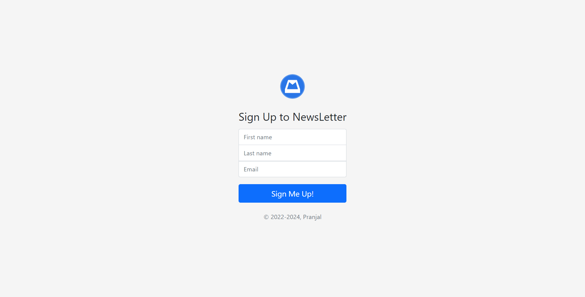
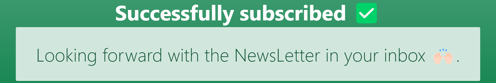
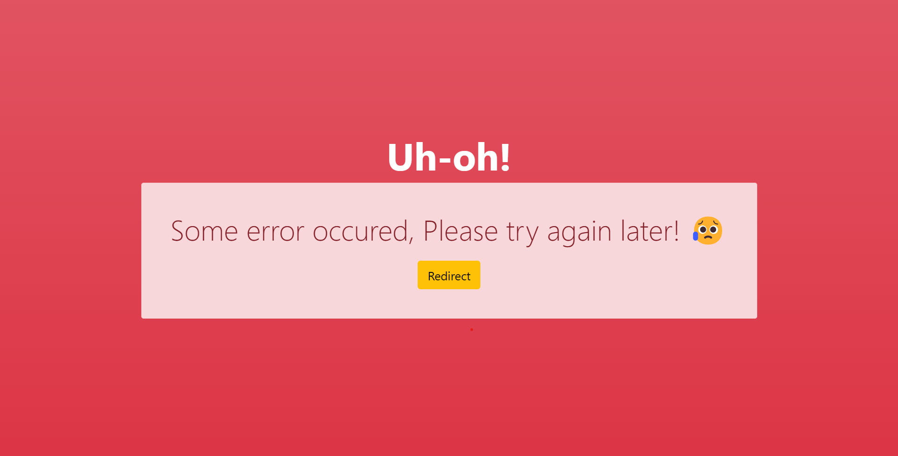

# Newsletter-Signup
The Web app focusses on implementing Full Stack Web Development Using NodeJS and ExpressJS as backend along with use of requests module for working with third party apis.

This project is a template for newsletter signup page which adds users to my newsletter using mailchimp's apis.

## Snapshots:
### Home Page-

### Success Page-

### Failure Page-

For the website I've used the following resources:
* ***Icons***: [FlatIcons](https://www.flaticon.com/)
* ***Fonts***: [GoogleFonts](https://fonts.google.com/)
* ***Bootstrap***: [Bootstrap](https://getbootstrap.com/)
* ***External Packagers***: [NPM](https://www.npmjs.com/)
